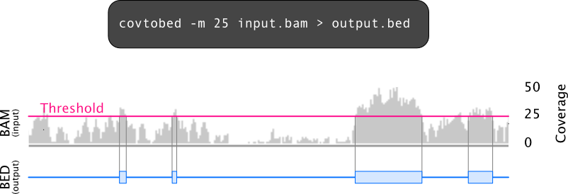

# covtobed 0.3 - a tool to generate BED coverage tracks from BAM files

[](https://github.com/telatin/covtobed/blob/master/LICENSE)
[](http://bioconda.github.io/recipes/covtobed/README.html)
[](https://travis-ci.org/telatin/covtobed)
[](https://hub.docker.com/r/andreatelatin/covtobed)


Read one (or more) alignment files (sorted BAM) and prints a BED with the coverage. It will join consecutive bases with the same coverage, and can be used to only print a BED file with the regions having a specific coverage range.





Synopsis:
```
Usage: covtobed [options] [BAM]...

Computes coverage from alignments

Options:
  -h, --help            show this help message and exit
  --version             show program's version number and exit
  --physical-coverage   compute physical coverage (needs paired alignments in input)
  -q MINQ, --min-mapq=MINQ
                        skip alignments whose mapping quality is less than MINQ
                        (default: 0)
  -m MINCOV, --min-cov=MINCOV
                        print BED feature only if the coverage is bigger than
                        (or equal to) MINCOV (default: 0)
  -x MAXCOV, --max-cov=MAXCOV
                        print BED feature only if the coverage is lower than
                        MAXCOV (default: 100000)
  -l MINLEN, --min-len=MINLEN
                        print BED feature only if its length is bigger (or equal
                        to) than MINLELN (default: 1)
  -v                    prints program version
  --output-strands      outputs coverage and stats separately for each strand
  --format=CHOICE       output format
```
## Example

Command:
```
covtobed -m 0 -x 5 test/demo.bam
```
Output:
```
NC_001416.1	1112	1120	4
NC_001416.1	1120	1999	0
NC_001416.1	2653	2674	4
NC_001416.1	2674	2686	3
NC_001416.1	2686	2762	2
NC_001416.1	2762	2771	1
NC_001416.1	2771	2800	0
```
## Install

To install with Miniconda:

```
conda install -c bioconda covtobed
```

Both **covtobed**, and the legacy program [**coverage**](coverage.md) are available as a single Docker container:
```
sudo docker pull andreatelatin/covtobed
```

## Requirements and compiling

This tool requires **libbamtools** and **zlib**.

To manually compile:
```
c++ -std=c++11 *.cpp -I/path/to/bamtools/ -L${HOME}/path/to/lib/ -lbamtools -o covtobed
```

## Acknowledgements

This tools uses [libbamtools](https://github.com/pezmaster31/bamtools) by Derek Barnett, Erik Garrison, Gabor Marth and Michael Stromberg, and [cpp-optparse](https://github.com/weisslj/cpp-optparse) by Johannes Weißl. Both tools and this program are released with MIT license.


## Authors

Giovanni Birolo ([@gbirolo](https://github.com/gbirolo)), University of Turin, and Andrea Telatin ([@telatin](https://github.com/telatin)), Quadram Institute Bioscience. 

This program was finalized with a Flexible Talent Mobility Award funded by BBSRC through the [Quadram Institute](https://quadram.ac.uk).
