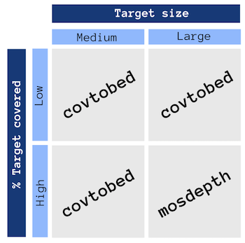

# Benchmark

*covtobed* is faster than *mosdepth* on small genomes, and on large genomes (like the Human genome) with a limited fraction of the target covered (e. g. target enrichment panels). With panels it can be up to 60X faster than *mosdepth*.
With large genomes highly *covered* (e. g. exomes, whole genome sequencing) is slightly slower than *mosdepth* (3-4X slower).

## How to run

The benchmark has been performed using [hyperfine](https://github.com/sharkdp/hyperfine), installable via conda.

To download the datasets use the `get_datasets.sh` script. 
The script will download two target enrichment panels (BAM).
If invoked with a parameter, will also download an exome from the 1000 Genomes Project.

A `benchmark_stream.sh` script will compare _covtobed_ to _bedtools_, redirecting the output to `/dev/null`,
while `benchmark_disk.sh` will also compare _mosdepth_.

_samtools_ is only included in the streaming section, but should be noted that produces a non-BED output, and the coverage will not be counted in deletions, that is not the intended behaviour in _covtobed_ (but this explains the much bigger computation time).

## Results: Linux VM (64 Gb RAM, 8 cores)

*covtobed* is constantly faster than *bedtools*.

*covtobed* is up to 20 times faster than *mosdepth* on medium datasets (_e. g._ Human gene panels), while on larger datasets (_e. g._ Human whole exomes) it's up to 5 times slower.

### Straming speed (not saving to disk)

_mosdepth_ is not included as it only saves to file. Other commands were redirected to `/dev/null`.
See also [example2.bam benchmark](stream/benchmarkStream_example2.md). 

| Command | Mean [s] | Min [s] | Max [s] | Relative |
|:---|---:|---:|---:|---:|
| `samtools depth -a /example1.bam` | 600.603 ± 3.205 | 596.251 | 604.440 | 573.92 ± 26.79 |
| `bedtools genomecov -bga -ibam example1.bam` | 34.717 ± 0.952 | 33.325 | 36.090 | 33.17 ± 1.79 |
| `covtobed example1.bam` | 1.046 ± 0.049 | 0.982 | 1.096 | 1.00 |

### Saving the output to disk

This is the test done saving to file. 
Note that _mosdepth_ will save the file compressed and indexed, thus requiring more time, 
and it's the only program tested supporting multithreading (only for BAM decompression). 

See also [example2.bam benchmark](disk/benchmark2_example2.md).

| Command | Mean [s] | Min [s] | Max [s] | Relative |
|:---|---:|---:|---:|---:|
| `mosdepth -x m_ example1.bam` | 68.344 ± 1.750 | 66.352 | 69.629 | 65.23 ± 2.22 |
| `mosdepth -x -t 8  m2_ ex1.bam` | 65.891 ± 0.736 | 65.123 | 66.590 | 62.89 ± 1.57 |
| `covtobed  example1.bam > ex1.bed` | 1.048 ± 0.023 | 1.021 | 1.063 | 1.00 |
| `bedtools genomecov -bga -ibam ex1.bam > ex1.bed` | 32.478 ± 0.798 | 31.830 | 33.370 | 31.00 ± 1.03 |

## Results: macOS 10.15, MacBook Pro (16-inch, 2019)

_mosdepth_ is not available for macOS. 
Streaming test.

| Command | Mean [s] | Min [s] | Max [s] | Relative |
|:---|---:|---:|---:|---:|
| `covtobed example2.bam` | 1.314 ± 0.024 | 1.289 | 1.346 | 1.00 |
| `bedtools genomecov -bga -ibam example2.bam` | 18.190 ± 0.134 | 18.071 | 18.398 | 13.84 ± 0.27 |
